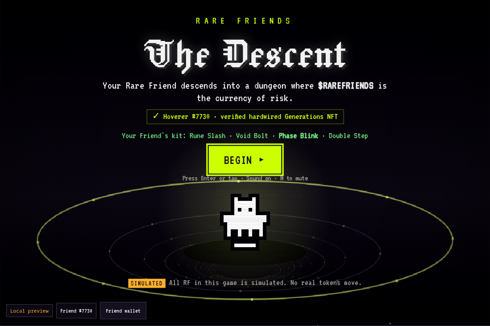
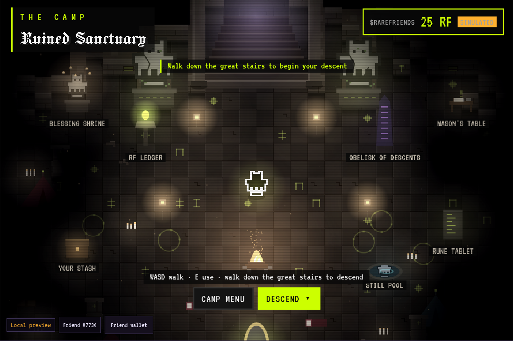
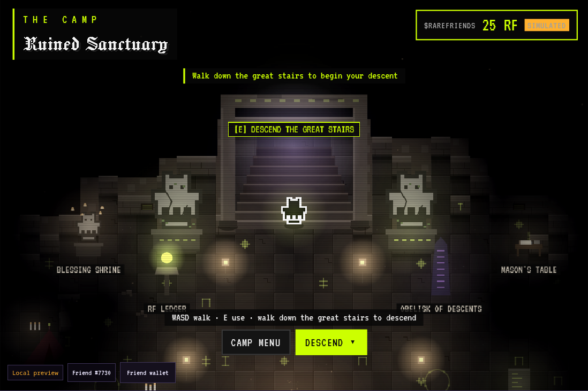
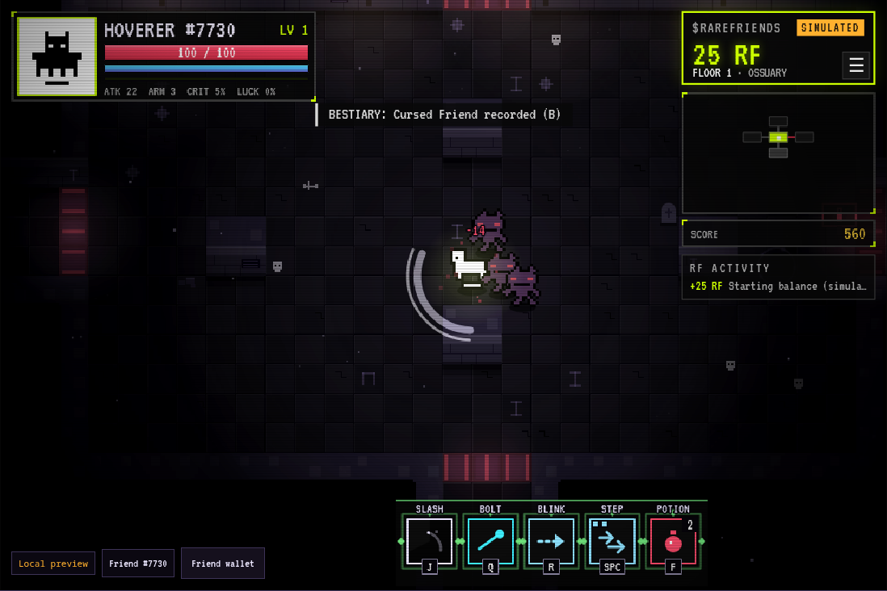
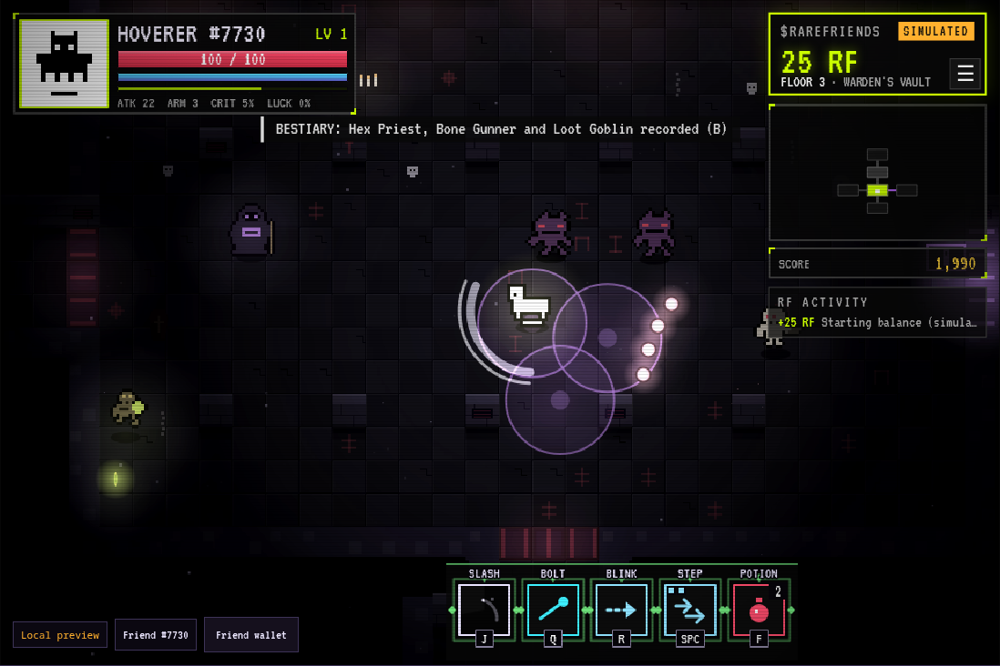
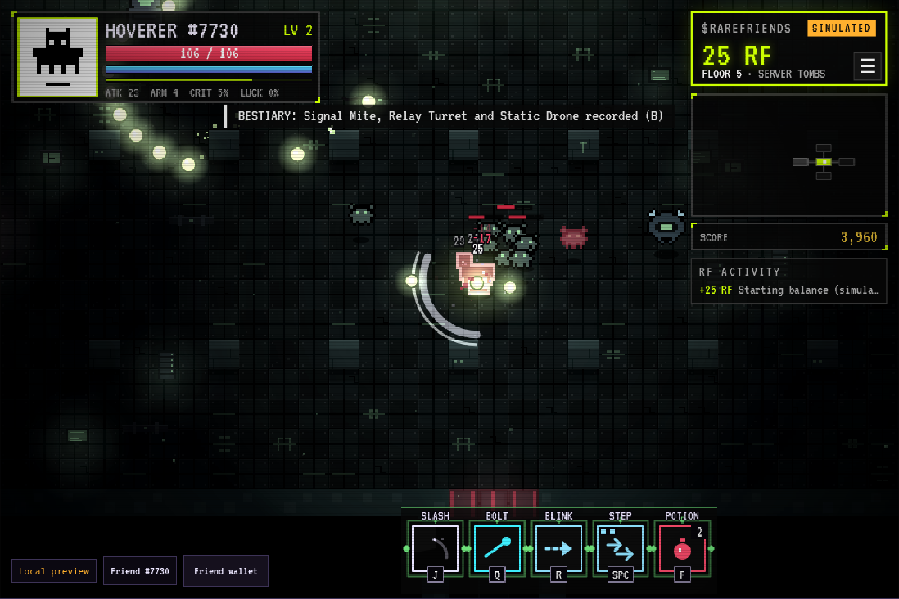
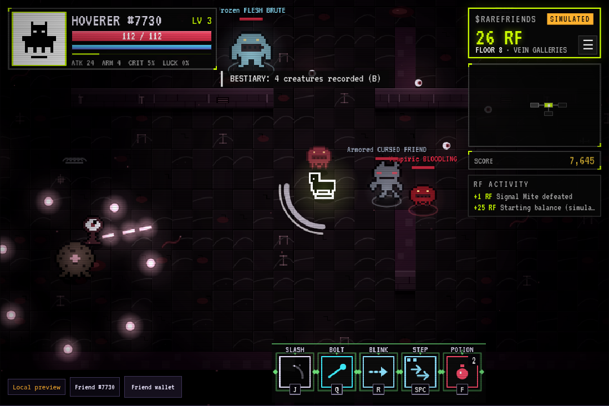
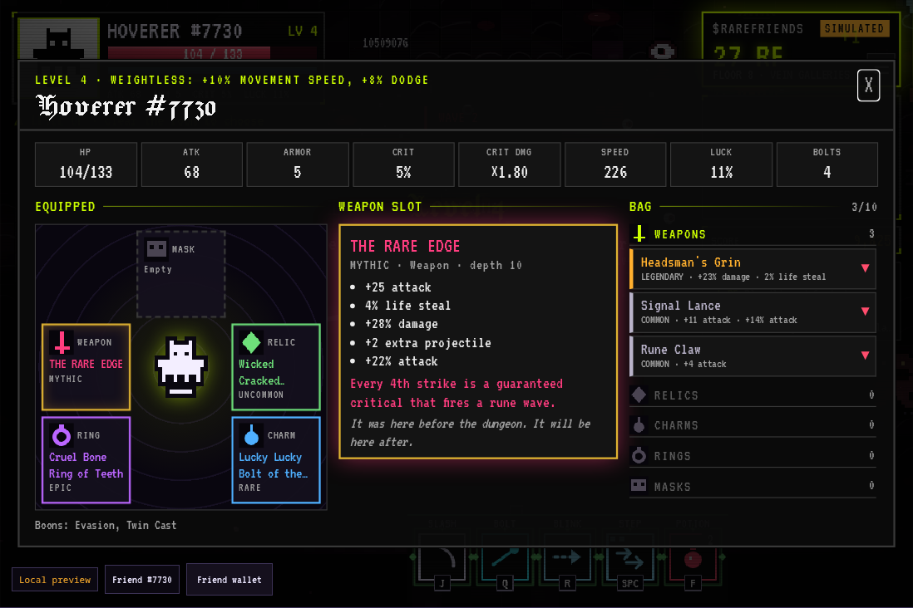
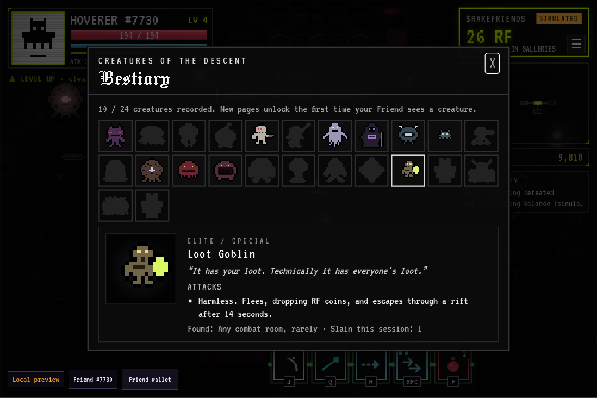
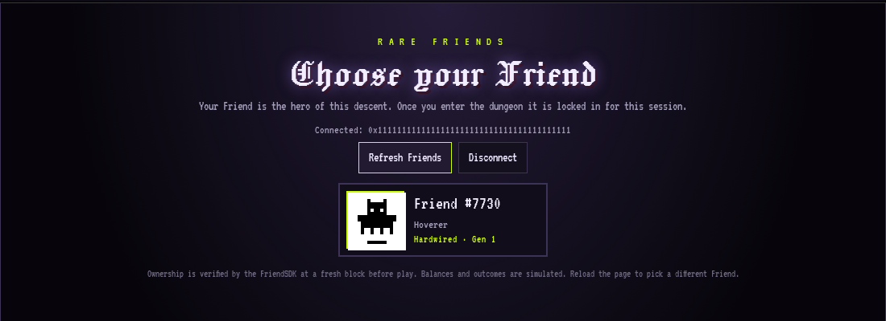

# Rare Friends: The Descent

**Your Rare Friend descends into a dungeon where $RAREFRIENDS is the currency of risk.**

A dark bullet-hell action-RPG dungeon crawler for the Rare Friends Vibeathon. Your own Generations NFT is the playable hero. It fights through procedurally generated floors of cursed crypts, finds randomized loot, and at every turn faces the same question: *spend 5 RF now, save for 10, or risk everything for 25?* Every run ends with a **score**, and RF can also dress your Friend in **cosmetic glows, skins and trails** at the camp. The dungeon is drawn in the Rare Friends style: black, white and grey, with muted color and soft, warm light.

| | |
|---|---|
| **Builder** | M4S4T0 · GitHub [@M4S4T0-V01D](https://github.com/M4S4T0-V01D) |
| **Category** | Game (FriendSDK). Entered for **Character Spotlight**, **Token Activity** and **Economy Potential** |
| **Stack** | FriendSDK **v0.1.2** runtime · TypeScript · React 19 (UI) · Canvas 2D renderer · Web Audio |
| **Playable preview** | **https://m4s4t0-v01d.github.io/rare-friends-the-descent/** (wallet and Generations NFT required) |
| **Showcase (no wallet)** | **https://m4s4t0-v01d.github.io/rare-friends-the-descent/live-preview/**: gameplay trailer with sound, a family-by-family guide to every Friend's kit (with each family's voice), and screenshots |
| **Requirements** | A browser wallet on **Robinhood mainnet (chain 4663)** holding a **hardwired Rare Friends Generations NFT (generation ≥ 1)** |
| **Economy** | **SIMULATED $RAREFRIENDS.** No real money, no token transfers, no purchases, no transactions. |

---

## Screenshots

| | |
|---|---|
|  |  |
| **Title.** Your verified Friend, its kit, and the simulated-RF label. | **The camp.** Walk your Friend around a ruined sanctuary before each descent. |
|  |  |
| **The great stairs.** Two statues of *your* Friend guard the way down. | **Depth 1 · Ossuary.** Cursed Friends in the upper crypts. |
|  |  |
| **Depth 3 · Warden's Vault.** Hex Priest curse circles and a Loot Goblin. | **Depth 5 · Server Tombs.** A mite swarm under turret fire. |
|  |  |
| **Depth 8 · Vein Galleries.** Named champions and an Eye Stalk's needles. | **Character sheet.** Paper-doll gear and a bag grouped by item type. |
|  |  |
| **Bestiary (B).** A page for every creature your Friend has met. | **Friend picker.** Each Friend's on-chain artwork and family (test fixture wallet shown). |

Screenshots are captured from the shipped site by `node scripts/screenshots.mjs`, using the FriendSDK's mock wallet fixture and sample Friend #7730.

---

## The three categories, at a glance

**Character Spotlight: your Rare Friend is the dungeon hero.**
The SDK verifies that you own the Friend, and the game then reads that Friend's canonical 16×16 on-chain artwork. The same pixels appear everywhere: walking and fighting through the dungeon with its real idle and walk animations, as the canonical black-on-white portrait in the HUD, on the title screen, at the camp, in boss introductions ("Hoverer #7730 vs Dungeon Warden"), in the character sheet and on the end-of-run summary. The elite enemy, the **Corrupted Friend**, is a crimson reflection of *your own* Friend. The secret boss, **The Unminted**, wears your Friend's silhouette as living void. Each Generations family also grants a unique passive (Skeleton, Mask, Family, Cellular, Asymmetry, Hoverer, Colossus, Sparkling, Hollow). On top of that, **every Friend gets its own combat kit** (see [Every Friend plays differently](#every-friend-plays-differently)).

**Token Activity: RF is spent and earned constantly.**
Every floor presents about **7–8 paid RF decisions**, measured across 900 generated floors: 1.5 shrines, 1 RF gate, about 1 paid event, a merchant on 58% of floors, and roughly 3.7 loot chests, each with an escalating 5 → 10 → 25 RF reroll. Revives cost 10 or 25 RF. Pay-to-play mini-games (5 or 10 RF) pay back on skill, and between runs the camp's **Dye Altar** sells 20 cosmetics for 5, 10 or 25 RF. Kills, elites, treasure, events and bosses pay RF back, and RF earned counts toward your score. Every movement shows up in a live **RF ACTIVITY** feed in the HUD, in a full ledger (Tab), and in the end-of-run summary.

**Economy Potential: a small-number risk economy built for real RF later.**
Every price lives in one file ([`src/economy/terms.ts`](src/economy/terms.ts)), uses only **5, 10 and 25 RF**, and is pinned by tests. Gameplay spends through a single [`TokenEconomy`](src/economy/TokenEconomy.ts) interface and grants an outcome only after the spend's receipt resolves. The shipped `SimulatedTokenEconomy` already uses the SDK's 18-decimal bigint RF units. A live adapter can replace it without touching combat, loot or UI code (see [Future real-token integration](#future-real-token-integration)).

---

## How to play

1. Connect your wallet and choose your Friend from a picker that shows each Friend's own on-chain artwork and family. The FriendSDK verifies ownership at a fresh block, and once you enter, that Friend is locked in for the session (reload the page to pick another).
2. **Begin** at the title and arrive at **the camp**: a ruined sanctuary of the ancient Rare Friends. Walk around with your Friend among tents, a campfire, lanterns and broken columns. Use the stations (your stash, the Rune Tablet codex, the Obelisk of Descents with your scores, the RF Ledger, the Still Pool that shows your Friend's kit, and the **Dye Altar** wardrobe), then walk down **the great stairs**, through a ruined arch flanked by two stone statues of your own Friend, to descend. The arch's pillars are solid, and on the steps your Friend passes between them and under the lintel instead of clipping through.
3. Clear rooms, loot, make RF decisions, go deeper. A **guardian** (mini-boss) blocks the stairs on every floor without a boss, and bosses wait at depths 3, 6 and 9. Pay-to-play **mini-games** hide in event rooms, and every creature you meet unlocks a page in the **bestiary** (B).
4. Escape at a Waystone with your loot, or die and decide whether RF can buy you another chance. Either way, the run is scored.

**The dungeon is dangerous.** Your Friend starts with 100 HP, 2 potions, and grows slowly (+6 HP, +1.2 attack per level). Enemies hit hard from the first room and scale with depth. Dodge-rolling through bullets, not trading hits, is how you survive.

### The Rare Friends look

Rare Friends are black and white, so the dungeon is too. The whole world is graded toward monochrome (color muted to about half, soft blacks, slightly lifted brightness). Glows, bullets and telegraphs light the dark and keep their color, so every attack stays readable. The room you stand in carries a soft ambient light so a fight reads edge to edge, every enemy wears a faint halo so it never hides in the dark (except the Grave Wraith, which is meant to), and torches, shrines and your Friend's glow tint the stone with their color. The lighting mask is drawn at quarter resolution and smoothly upscaled, which keeps soft light for a fraction of the cost. Panels and menus use neutral blacks and greys, keeping the lime RF accent. It is on by default; **Pause → Settings → Rare Friends look** switches back to full color.

### Performance

The world, the HUD and the CRT scanlines are three stacked canvases. The Rare Friends grade is a CSS filter on the world layer, so the browser's compositor applies it (on the GPU where there is one) instead of the game re-filtering every pixel each frame, and the static scanlines are drawn once instead of blended every frame. The picture is the same: a deterministic replay of 13 scenes matches the single-canvas renderer within 3 color levels. Measured in headless Chromium with software rendering and the CPU slowed 4× (the slow-device worst case), the depth-8 stress room went from 18–19 to 30 fps and the Rare Beast fight from 21–24 to 36 fps. Game logic takes under 2 ms a frame even in the stress room, and the React HUD does not re-render during combat.

### Sound

Every place has its own little creepy dungeon tune, composed as a looping song and played live by synthesized instruments (no recordings):

| Place | Tune |
|---|---|
| Camp | Melancholy music-box lullaby in A minor, with fire crackle |
| The Upper Crypts | Harpsichord danse-macabre waltz in D harmonic minor (3/4), with dripping water |
| The Signal Vaults | Nervous E-minor chiptune: square lead, arpeggios, drums |
| The Hollow Deep | Slow bell melody in C harmonic minor over a lub-dub heartbeat |
| The Endless Void | Glassy whole-tone bells, dreamy and wrong |
| Boss fights | Driving D-minor bass, harpsichord and drums |

**Special rooms have their own music.** Walk into one and its tune fades in over about 1.5 s while the floor's tune ducks away underneath; walk out and it fades back. Changing floors crossfades too, so music never cuts.

| Special room | Tune |
|---|---|
| Shrine of Greed / Shrine of Fate | A hushed, holy-but-wrong choir with harp arpeggios and a bell (D minor) |
| Shrine of the Void, The Black Door | A dissonant whole-tone choir over a slow heartbeat, with glitches |
| The Corpse | A funeral dirge: tolling bell, low organ and a mourning voice (C minor) |
| A Lost Friend | A warm music-box lullaby with harp, the only kind tune in the dungeon (F major) |
| The Well, The Stranger, The Mirror | Tense pizzicato bass and a tritone harp line (A minor) |
| Moth, the Peddler | A crooked bazaar tune over a hand-drum groove (D phrygian dominant) |
| The Gambler | A sly walking-bass chiptune (C minor) |
| Treasure rooms, The Golden Door, The Coin Dash | Glittering music-box arpeggios and bells (E major) |
| The Rune Gallery, The Shell Game | The Gambler's sly walking-bass chiptune |
| Secret rooms | Whole-tone harp glissandi and a far-off bell |

**Every attack has a sound, kept soft so fights stay readable.** Each enemy bullet kind has its own voice as it fires: orbs a low *bwup*, pellets a dry pop, needles a thin *pew*, lobbed globs a wet thump, shards a glassy tink, and a Relay Sniper's round a sharp crack. Sounds are a little quieter the farther away they are, and rate-limited so a 20-bullet ring is one sound, not twenty. Lingering blasts hiss or zap as they ignite, bullets tick when they break on walls, and Signal Mites skitter as they leap. Your Friend's bolt style has its own sound too: Void Bolt, Scatter Shards (three quick tinks) or Piercing Lance (a charged zap).

Each tune loops in sections (the melody rests, then returns an octave up) so it does not wear thin. `node scripts/render-music.mjs` renders every tune, including the special-room songs, to `artifacts/music/*.wav` for listening. **Each Generations family has its own voice** (Skeleton bone-clacks, Mask hollow toks, Family chirps, Cellular bubbles, Asymmetry detuned zaps, Hoverer airy whooshes, Colossus deep thuds, Sparkling chimes, Hollow echoing pings), heard when you dodge, get hit, cast your signature, land a heavy blow or level up. Each Friend's on-chain seed tunes its voice slightly, so no two sound quite alike. Mute with M; music has its own toggle.

### Every Friend plays differently

Each Friend's kit is derived from its Generations family and its own on-chain art seed. The same Friend always gets the same kit, and there are 5,184 possible combinations, each reachable and evenly distributed.

| Slot | What varies | Options |
|---|---|---|
| **R · Signature** (by family) | A unique ability | Skeleton **Bone Spikes** · Mask **Masquerade** · Family **Rally** · Cellular **Mitosis** · Asymmetry **Chaos Rift** · Hoverer **Phase Blink** · Colossus **Earthshatter** · Sparkling **Prism Burst** · Hollow **Void Pull** |
| **J · Attack** (by seed) | Reach, arc and speed | Rune Slash (wide combo) · Piercing Lunge (long thrust that steps in) · Whirl (hits all around) |
| **Q · Bolt** (by seed) | Spread, range and piercing | Void Bolt · Scatter Shards (3-shard fan) · Piercing Lance (pierces 3) |
| **Space · Dodge** (by seed) | Charges | Dash (1 long) · Double Step (2 short charges) |
| **Action bar** (by seed) | Look | 4 frame styles (corner brackets, ring, diamond gems, notched) × 8 accent colors, drawn around each slot so key bindings always stay readable on their own keycaps |

The kit is shown on the title screen, in the camp's **Friend** tab, in the pause menu and on the action bar.

### Controls

| Action | Keyboard / mouse | Touch |
|---|---|---|
| Move | WASD or arrow keys | Drag on the left side |
| Attack (3-hit combo, hold to repeat) | J or left click | ATTACK |
| Bolt (your kit's style) | Q, L or right click | Bolt button |
| Signature ability (your family's) | R or N | Signature button |
| Dodge (brief invulnerability) | Space, Shift or K | DODGE |
| Potion (heals 30%) | F or H | ♥ |
| Interact / confirm | E or Enter | USE |
| Character sheet · bestiary · RF ledger · pause | C · B · Tab · Esc | ☰ |
| Mute | M | Pause menu |
| Choose in dialogs | 1 / 2 / 3, R to reroll | Tap |

The mouse aims when you move it; keyboard players get soft auto-aim toward the nearest enemy they face. Clicking outside the game mid-fight pauses it.

### The first minute

Title → wallet → Friend → camp → **Depth 1**. The first room holds three Cursed Friends. Clearing it always drops a visible weapon upgrade. The very next room is the **Shrine of Greed (5 RF)**, your first RF decision. Depth 2 **always** contains the **Shrine of the Void (25 RF)**, the game's signature "give everything" moment.

---

## The $RAREFRIENDS economy (simulated)

**Every Friend starts with 25 RF on its very first visit, and that is the only free RF.** Its balance is then saved with the Friend (see [Saved progress](#saved-progress)). After that there are no top-ups: each descent begins with exactly what your Friend carried out of the camp, so RF you spend on cosmetics or lose to bad gambles stays spent, and RF you earn in the dungeon is what funds the next descent. RF is only ever spent by your own choice. Dying never takes RF. You can play with 0 RF; you just cannot pay for shrines, gates, rerolls, revives or mini-games.

### What RF buys

| | 5 RF | 10 RF | 25 RF |
|---|---|---|---|
| **Shrines** | Shrine of Greed: small blessing | Shrine of Fate: medium blessing | Shrine of the Void: major gamble |
| **Dungeon gates** | Blood Gate: optional combat room, better chest | Cursed Gate: elite encounter, Rare+ chest | Abyssal Gate: 3-wave vault, Epic+ chest, Mythic possible |
| **Loot rerolls** (per chest) | 1st reroll | 2nd reroll | 3rd reroll (no 4th) |
| **Revive** (on death) | | Revive: 40% HP | Full Revival: 100% HP, curses cleansed, damaging burst |
| **Merchant: Moth, the Peddler** | Health Potion (×2) · Cursed Mystery Box | Random Relic · Rare Item | Legendary Gamble |
| **Events** | The Well · The Gambler | The Stranger · The Golden Door | The Black Door |
| **Mini-games** | The Rune Gallery · The Shell Game | The Coin Dash | |
| **Dye Altar cosmetics** (camp) | Common glows, Statue Stone skin, Embers trail | Rare glows, Corrupted / Lost Light / Frostbitten / Cinder / Shadow skins, Sparkles and Void Motes trails | Prismatic and Null Halo glows, Gilded and Unminted Void skins, Rune Steps trail |

### What RF pays back

| Source | Reward |
|---|---|
| Normal enemy | **+1 RF**, 6% chance (doubled for champions; raised by RF-find items, the Sparkling family and the Fortune boon) |
| Loot Goblin | **+1 RF** coins while it flees (max 3 per goblin) |
| Elite (Corrupted Friend) | **+2 RF** |
| Treasure room / The Corpse | **+3 RF** |
| Rare event (Lost Friend, secret room, horde survived, Void-hunt bounty) | **+5 RF** |
| Guardian (the mini-boss before a floor's stairs) | **+3 RF** |
| Mini-boss (Dungeon Warden, depths 3 and 6) | **+5 RF** |
| Boss (The Rare Beast, depth 9) | **+10 RF** |
| Secret boss (The Unminted) | **+25 RF** |
| The Gambler (5 RF stake) | 0 RF 45% · 5 RF 30% · 10 RF 17% · 25 RF 8% |
| The Rune Gallery (5 RF) | 7+ runes 5 RF · 10+ 10 RF · 14+ 15 RF · 18+ 20 RF |
| The Shell Game (5 RF) | 15 RF for the right cup |
| The Coin Dash (10 RF) | 1 RF per coin grabbed, up to 20 |

### Shrine odds

Odds are shown in every shrine and event dialog. All tables sum to 100% (pinned by tests).

| Shrine of Greed · 5 RF | | Shrine of Fate · 10 RF | | Shrine of the Void · 25 RF | |
|---|---:|---|---:|---|---:|
| +10% damage, 2 rooms | 25% | +20% damage, 3 rooms | 22% | Legendary loot | 28% |
| Heal 15% HP | 20% | Full heal | 18% | Mythic loot | 10% |
| +5% speed this floor | 20% | +8% crit, 3 rooms | 18% | Void-Touched: +25% dmg, +8% crit, +10% speed for the run | 20% |
| Reveal the floor map | 15% | Next chest Rare or better | 17% | Summon a Void-hunting elite (drops Legendary + 5 RF) | 17% |
| Small loot bonus (+15% luck, 2 rooms, and an Uncommon+ item) | 20% | Reveal a secret room | 10% | Void Curse: −30% max HP, +25% damage taken, 3 rooms | 15% |
| | | Loot frenzy, 3 rooms | 15% | Secret boss: The Unminted (+25 RF, Mythic-grade loot) | 10% |

### Event odds

| Event | Cost | Outcomes |
|---|---|---|
| The Well | 5 RF | Heal 30% · blessing 20% · curse 15% · small loot 20% · nothing 15% |
| The Stranger | 10 RF | Reveals a secret room 30% · disappears 20% · gives a Rare+ relic 35% · summons an elite 15% |
| The Black Door | 25 RF | Secret boss 25% · Mythic chest 20% · cursed dungeon (Legendary hoard) 25% · enormous horde (+5 RF) 30% |
| The Golden Door | 10 RF | Epic 65% · Legendary 28% · Mythic 7% item |
| The Gambler | 5 RF | See the payout table above |
| The Mirror | free | Duplicate your strongest item (copy is secured) 50% · destroy it 50% |
| The Corpse | free | Loot 40% · ambush 25% · +3 RF 20% · curse 15% |
| A Lost Friend (rare) | free | +5 RF and a 25% heal |

Merchant gambles: **Legendary Gamble** Epic 30% · Legendary 58% · Mythic 12%. **Cursed Mystery Box** cursed item 55% · 2 potions 20% · curse 15% · Epic item 10%.

### Mini-games: pay to play, skill to profit

Event rooms can hold one of three mini-games. Each costs RF up front and pays out on how well you play, so a sharp player comes out ahead and a sloppy one feeds the house. Rules are shown in the dialog before you pay, and payouts arrive through the same economy as everything else.

| Mini-game | Stake | How it works | Payout |
|---|---|---|---|
| **The Rune Gallery** | 5 RF | For 15 seconds, golden runes pop up around you two at a time and fade fast (faster as your tally climbs). Shatter them with any attack. | 7+ runes 5 RF · 10+ 10 RF · 14+ 15 RF · 18+ 20 RF |
| **The Shell Game** | 5 RF | A rune hides under one of three bone cups, which then shuffle (more and faster swaps deeper down). The shuffle is real: follow the right cup and click it (or press 1–3). | 15 RF if you pick right |
| **The Coin Dash** | 10 RF | For 15 seconds, 20 coins scatter across the room while rocks rain down around you, each telegraphed by a grey circle. Grab coins, dodge rocks. | 1 RF per coin (up to 20) |

A timer and tally sit at the top of the screen while the Gallery or the Dash runs.

### The Dye Altar: cosmetics for RF

At the bottom of the camp stands **the Dye Altar**, a tall mirror that shows your Friend as it is dressed. Its **Wardrobe** tab (also in the camp menu) sells cosmetics for simulated RF through the same `TokenEconomy` as every other spend, recorded in the ledger as `Dye Altar: <name>`. Owned looks can be swapped for free.

| Slot | Options |
|---|---|
| **Glows** (the light around your Friend) | Signal Lime (free) · Blood Moon, Relay Cyan, Crypt Violet (5 RF) · Hoard Gold, Void Rose, Frostlight (10 RF) · **Prismatic** (cycles every color) and **Null Halo** (a pocket of darkness with a burning rim) (25 RF) |
| **Skins** (your Friend's pixel color) | Canonical (free) · Statue Stone (5 RF) · **Corrupted** (the crimson of the Corrupted Friends), Lost Light, Frostbitten, Cinder, Shadow (10 RF) · Gilded, Unminted Void (25 RF) |
| **Trails** (what your steps leave behind) | None (free) · Embers (5 RF) · Sparkles, Void Motes (10 RF) · Rune Steps (25 RF) |

Cosmetics only **recolor** your Friend's canonical on-chain pixels and add light: the artwork's shape is never altered, and cosmetics give no power. The HUD portrait always shows the canonical black-on-white art. Worn looks appear in the dungeon, at the camp, on the title and summary screens, and in the Dye Altar's mirror. Like the stash, bought cosmetics are saved with your Friend (see [Saved progress](#saved-progress)).

### Scoring

Every run ends with a score, shown line by line on the summary screen (counting up to the total), added to your **lifetime score**, and ranked in the Obelisk of Descents (the Hall). A live **SCORE** panel under the minimap shows the run so far, and the death and Waystone dialogs preview what ending now would be worth.

| Line | Points |
|---|---|
| Depth reached | 500 × depth + 50 × depth² |
| Enemies slain | 10 each |
| Elites slain | 60 each |
| Guardians slain | 400 each |
| Bosses | 1,000 per Warden · 3,000 for The Rare Beast · 2,500 for The Unminted |
| Friend level | 120 per level above 1 |
| **Loot on your Friend** (everything equipped or in the bag when the run ends) | Common 10 · Uncommon 30 · Rare 75 · Epic 180 · Legendary 450 · Mythic 1,200 (cursed items ×1.25) |
| RF earned | 15 per RF |

**How the run ends multiplies the total:** conquered (escaped after The Rare Beast) **×2**, escaped at a Waystone **×1.5**, fell in the dark **×0.75**, abandoned **×0.5**. Dying with a bag full of Legendaries still scores them, but escaping with them is worth twice as much. The formula lives in [`src/game/score.ts`](src/game/score.ts) and is pinned by unit tests.

### Share your run

The run-complete screen has two share buttons:

- **Post on X** opens X's post composer with a line about your run (Friend, outcome, depth, score, kills, bosses) and a link back to the game, and puts an image of your scoreboard on your clipboard so you can paste it straight into the post.
- **Copy image** copies the scoreboard image, ready to paste into any chat or post.

The image is a 1200×675 card in the Rare Friends look: your Friend's canonical black-on-white artwork, the outcome, your score (with a NEW BEST badge), depth, kills, guardians, bosses, rarest loot, RF earned and time.

How it works: the game runs in the FriendSDK's scripts-only sandbox, which cannot use the clipboard or open windows. So it draws the card and sends a share request to The Descent's trusted host page ([`host/shareRelay.ts`](host/shareRelay.ts)) with `postMessage`. The host accepts requests only from the game's own frame and checks the image type and size and the text length. It then writes the image to the clipboard and, for a post, opens `x.com/intent/post`, building the URL itself from its own page address. If no host answers or the browser blocks the clipboard, the game shows the card instead, so you can right-click to copy or save it (with the post text ready to copy).

### Saved progress

Progress saves automatically, **per Friend, under the Friend's own wallet**: its canonical Generations wallet (the token-bound account the SDK reads during discovery), since the SDK treats inventory and rewards as belonging to the Friend. The title screen shows where it saves, e.g. *"Progress saves automatically to Hoverer #7730's wallet 0x1234…abcd in this browser."*

- **What is saved:** the simulated RF balance and ledger, the stash and chosen heirloom, the codex, the Obelisk of Descents (top 5 runs, lifetime and best score), the bestiary, bought and worn cosmetics, and settings.
- **When:** within a second of any RF movement, at the end of every run, whenever anything changes (checked every 5 s), and when the tab is hidden or closed.
- **Closing mid-run counts as End Run:** secured loot (Waystone or heirloom) goes to the stash and everything else is lost, so closing the tab can never duplicate items. RF already earned or spent stays that way.
- **The 25 RF start is granted once per Friend, ever.** Reloading resumes your balance; it never tops it up.

How it works: the game's sandbox has no storage, so it posts its save to The Descent's trusted host page ([`host/saveRelay.ts`](host/saveRelay.ts)), which keeps it in that page's `localStorage` under `descent:save:v1:<chain>:<Friend wallet>`. The host answers only the game's own iframe, only while a Friend is in play (after `ConnectedGameHost`'s fresh ownership check), and only accepts a save that names that same Friend and stays under 512 KB. Changing account or network stops saving until the new Friend is verified. When the game loads a save, [`src/game/save.ts`](src/game/save.ts) rebuilds it field by field (known item slots, rarities, stats and cosmetics only; numbers clamped; duplicates dropped), so a damaged or hand-edited save cannot break the game. Saves stay in the browser where you played; they are not synced between devices, and clearing site data erases them. Everything in them is simulated.

### Death, revival and extraction

- **Death:** choose **Revive (10 RF)**, **Full Revival (25 RF)** or **End Run**.
- **Waystones** appear after each boss (depths 3, 6, 9). Touching one **secures** everything you carry. You then **escape** (the run ends and all loot goes to your camp stash) or **descend** for more.
- **End Run after death:** secured items return to the stash; unsecured items and the run's progress are lost. Your RF balance is untouched.
- **Heirloom:** before a descent, carry one stash item into the dungeon. It is equipped and secured from the start.

---

## Loot, progression and enemies

**Rarities:** Common · Uncommon · Rare · Epic · **Legendary** · **MYTHIC**. Higher tiers roll more and stronger affixes. Legendary and Mythic drops get a light beam, a banner, sound and a particle burst.

**Slots:** Weapon · Relic · Charm · Ring · Mask. Better items auto-equip, and the rest go to a 10-slot bag. The character screen (C) shows your gear on a paper doll around your Friend, the bag grouped by item type with ▲/▼ upgrade markers, and a side-by-side comparison before you equip or destroy anything. **Cursed** items pair a large upside with a real downside and never auto-equip.

**Affixes** include +attack %, +movement speed, +critical chance and damage, heal on kill, burn, extra projectiles, loot chance, dodge, bonus damage below 35% HP, life steal, energy regeneration and RF find.
**Legendary powers:** Cinderheart, The Split Signal, Crown of Red Thirst, Glass Heart, Echo Engine, Ghoststep Sigil, Orrery of Runes, Last Light, Coin-Eater's Maw, Headsman's Grin.
**Mythic powers:** VOID HEART, THE RARE EDGE, CROWN OF THE FIRST FRIEND, NULL SIGNAL.

**Progression:** XP from kills and clears. Each level adds +6 HP, +1.2 attack and +0.6 armor (and heals only 6%), plus a choice of 3 of 16 boons, offered once the room is safe. Clearing a room heals just 2%, potions heal 30%, and life steal, evasion and crit chance are capped (12%, 20%, 60%), so no build turns the Friend into a tank.

**Enemies (bullet-hell patterns, every attack telegraphed).** Enemy damage starts at 1.2× and grows 36% per depth; health grows faster than before too, and rooms field about 20% more enemies.

| Enemy | Pattern |
|---|---|
| Cursed Friend | Fast melee |
| Void Crawler | Aimed orbs |
| Choir Wisp | Bullet rings |
| Bone Gunner | Shotgun spreads |
| Static Drone | Strafing 3-round bursts |
| Relay Turret | Rotating spiral |
| Signal Mite | Lunging swarm packs |
| Maw Spitter | Lobbed globs that burst into rings |
| Eye Stalk | A gaze line, then a needle stream |
| Bloodling | Splits in two |
| Null Shade | Blinks in with a bullet ring |
| **Grave Bomber** (new) | Sprints at you, lights its fuse and explodes; it also bursts when killed, so kill it at range |
| **Bone Lancer** (new) | Marks a line with its spear, then skewers straight down it |
| **Hex Priest** (new) | Brands the floor under you with curse circles, and every third cast mends its most wounded ally |
| **Relay Sniper** (new) | Tracks you with a laser sight, locks on, then fires one very fast round |
| **Flesh Brute** (new) | A slow, heavy hitter that pounds the ground and throws out a ring of gore; resists knockback |
| **Hive Mother** (new) | Rooted in place; births Signal Mites (up to 8) and pulses slow spores |
| **Grave Wraith** (new) | Nearly invisible (a faint shimmer) until it reveals itself and lunges |
| **Void Prism** (new) | Spits rotating crosses of bullets and sweeps a long laser across the room |
| Loot Goblin | Flees, drops coins, escapes after 14 s |
| Corrupted Friend | Elite: charge, slam |

Dodge-rolling through bullets is the core skill, and leftover enemy bullets vanish when a room is cleared.
**Modifiers:** Vampiric, Explosive, Frozen, Swarm, Frenzied, Armored, Teleporting, Cursed, and three new ones: **Shielded** (a bubble that blocks two hits, then reforms after 5 s), **Splitting** (splits into two smaller copies on death) and **Storming** (fires a bullet ring every few seconds). They apply to elites and to "champions", which are now more common deeper down.

**Guardians (mini-bosses).** Every floor from depth 2 that has no boss ends its main path in a guardian room right before the stairs. The guardian is a giant, titled form of one of that floor's creatures, about twice its size with nine times its health: The First Husk, Void Matriarch, The Choirmaster, Ossuary Captain, Static Overseer, Relay Bastion, The Great Maw, All-Seeing Stalk, The Clot, Null Sovereign, The Demolisher, Bone Champion, High Hexer, Deadeye Relay, The Butcher, Hive Queen, The Pale Widow or The Shattered Prism. It fights with its kind's own attacks, carries 1–2 modifiers and adds a **rage ring** of bullets every few seconds (more often when hurt), and at half health it **calls two of its kin**. It gets a boss bar, a banner and the boss music, and brings a small escort. Slaying one pays **+3 RF** and 400 score, and the room drops an elite chest (Rare or better). Guardian rooms show a crown on the minimap.

**The bestiary (B).** The first time your Friend sees a creature, its page unlocks, with a toast to tell you. Creatures met together share one toast ("BESTIARY: Static Drone, Relay Sniper and Grave Bomber recorded"), and at most three toasts show at once, so a new room never buries the fight under notices. Each page has the creature's portrait, a line of lore, what its attacks look like, where it lives, how many you have slain this session and whether you have beaten its guardian form. Unseen creatures show as dark silhouettes. Open it with **B** in the dungeon (or from the pause menu), or from the camp menu's Bestiary tab. It covers all 24 creatures, from the Cursed Friend to The Unminted.

**Bosses, redrawn and rearmed.** Every boss has new pixel art and a cinematic entrance: letterbox bars, a name card, and a moment of immunity while it rises.

- **Dungeon Warden** (depth 3) / **Warden of the Deep** (depth 6): a horned, armored jailer with a burning core, stepping legs and swinging chains; crimson and ember in the crypts, steel and ice-blue in the Signal Vaults. Its armor cracks and bleeds light in phase 2. New attacks: **Chains** (three whirling arms of bullets) and **Quake** (a fissure of slams marching toward you), alongside its slam, sweep, charge, summons, rings and blink.
- **The Rare Beast** (depth 9): a crowned maw with eyes that open with each phase and follow your Friend, and writhing tendrils. New attacks: **Eyes** (every eye fires a needle in turn) and **Curtain** (a wall of bullets sweeps the arena with a single gap), alongside claws, spirals, stomps, charges, pools and the sweeping beam.
- **The Unminted** (secret): your Friend's silhouette as living void. New attack: **Starfall**, a spiral of void stars raining around you.

**Every floor is its own place**, with its own palette, tile style, props and enemy roster:

| Depth | Floor | Look | New enemies |
|---|---|---|---|
| 1 | The Upper Crypts · Ossuary | Bone-strewn crypt slabs, gravestones, coffins | Cursed Friends, Choir Wisps, Grave Bombers |
| 2 | The Upper Crypts · Candle Nave | Candlelit amber crypt | Bone Gunners, Bone Lancers (first guardian) |
| 3 | The Upper Crypts · Warden's Vault | Chained vault, crimson accents | Grave Wraiths, Hex Priests (Dungeon Warden) |
| 4 | The Signal Vaults · Relay Halls | Bolted cyan tech plates, terminals, cables | Static Drones, Signal Mites, Relay Snipers |
| 5 | The Signal Vaults · Server Tombs | Green-lit server racks | Relay Turrets, Hive Mothers |
| 6 | The Signal Vaults · Signal Core | Pipes and screens in signal green | (Warden of the Deep) |
| 7 | The Hollow Deep · Red Gullet | Veined flesh, tendrils, blood pools | Bloodlings, Maw Spitters, Flesh Brutes |
| 8 | The Hollow Deep · Vein Galleries | Eyes in the floor | Eye Stalks |
| 9 | The Hollow Deep · The Beast's Heart | Ribcages and tendrils | (The Rare Beast) |
| 10+ | The Endless Void · Stratum N | Star-flecked void, shards, glitches | Null Shades, Void Prisms, and everything else |

**Look and feel:** each floor has drifting ambient motes (crypt dust, tech sparks, flesh spores, void stars). Enemies breathe, squash when hit and stretch while winding up, then flash and dissolve when they die; damage numbers pop in and settle; dodges leave afterimages in your glow's color; movement eases in and out instead of snapping. Under the hood, crowded fights are cheaper to draw: enemy bullets no longer spawn trail particles, sprite palettes are cached by a cheap key, and the particle pool trims in batches.

**The dungeon:** each floor is generated from a seed, and floors **grow larger and more complex as you descend**. The layout grid grows from 7×7 to 9×9 cells, and over 20 generated floors per depth, rooms go from about 9 to 22 and floor area almost quadruples. Deeper floors add loops (multiple routes), optional side-combat wings, branches off branches, and interior architecture: colonnades, dividing walls, inner rings and crosses. Every room tile is verified reachable. A main path of combat rooms leads to the stairs or the boss arena, with side rooms branching off it: treasure, shrines, the merchant, events, gated bonus rooms, and a hidden secret room behind a cracked wall (strike it three times). Floors run through The Upper Crypts, The Signal Vaults, The Hollow Deep and The Endless Void. After depth 9 you can keep descending for as long as you survive.

---

## Setup

Requires **Node.js 22+** on Linux (or Ubuntu on WSL2), plus a browser wallet as described above.

```sh
git clone <this repository>
cd DESCENT
npm ci
npm run dev          # http://127.0.0.1:4173
```

The FriendSDK v0.1.2 package archive is vendored at `vendor/rarefriends-friendsdk-0.1.2.tgz` (built with `npm pack` from [spokesz/friendsdk](https://github.com/spokesz/friendsdk) at the v0.1.2 release commit), so `npm ci` needs nothing else.

**How the site is built:** `npm run build` runs `scripts/site.mjs`. The FriendSDK CLI's `buildGame` builds the sandboxed game exactly as `friendsdk build` does. Then The Descent's trusted host page (`host/`) replaces the default runtime bundle. The host uses the SDK's own wallet session (`createFriendWalletSession`), owner-filtered discovery (`readOwnedFriends`) and `ConnectedGameHost`, which performs the fresh ownership and generation check before every session. Only the Friend picker is custom: it adds artwork thumbnails and locks the chosen Friend for the session. `npm run dev` builds and serves at http://127.0.0.1:4173 (re-run it after edits).

If your Playwright version has no matching browser download (for example in a sandbox with a preinstalled Chromium), point the browser checks at it with `CHROMIUM_PATH=/path/to/chromium npm run test:browser`.

**Build a static preview:** `npm run build` writes `site/`. Serve that folder from any HTTPS static host, keeping its relative paths and the child document's CSP. The included GitHub Actions workflow (`.github/workflows/pages.yml`) runs the checks, builds and deploys to GitHub Pages on every push to `main`. In the repository settings, set **Pages → Source** to **GitHub Actions**.

### Project layout

| Path | What it is |
|---|---|
| `index.tsx`, `game.json`, `host.css`, `style.css` | FriendSDK game entry, required SDK definition, trusted runtime theme, game UI styles |
| `host/` | Trusted host page: SDK wallet session, discovery and `ConnectedGameHost`, the Friend picker with thumbnails and the session lock, the save relay (per-Friend saves), and the share relay (clipboard and X) |
| `src/economy/` | `terms.ts` (every price and reward), `TokenEconomy.ts` (the interface), `SimulatedTokenEconomy.ts` |
| `src/game/` | Engine: `Game.ts` (run loop, combat, rooms, RF actions, room music, wardrobe, guardians, mini-games, bestiary tracking), `lore.ts` (bestiary pages), `dungeon.ts`, `enemies.ts` and `bestiary.ts` (bullet patterns), `kit.ts` (per-Friend kits), `items.ts`, `stats.ts`, `score.ts` (run scoring), `content.ts` (shrines, events, rosters, cosmetics) |
| `src/render/` | Canvas renderer, dungeon art, sprites (canonical Friend artwork plus original enemy art), `bossArt.ts` (mirrored pixel-art boss bodies) |
| `src/ui/` | React overlays: title, camp, HUD, dialogs (including the Shell Game), bestiary, summary, touch controls |
| `src/audio/` | Procedural sound effects and music (place tunes, special-room tunes, crossfading layers), plus the FriendSDK sound kit |
| `showcase/` | The no-wallet showcase page (served at `live-preview/`): HTML, CSS and a small script that builds the family guide from the game's own kit tables and plays each family's voice |
| `tests/unit/`, `scripts/` | Unit tests; browser, showcase, live-gate, balance-playtest, screenshot and trailer scripts (`bot-core.mjs` is the bot shared by the playtest and the trailer) |
| `docs/screenshots/`, `docs/showcase/` | README screenshots (`npm run screenshots`) and the showcase media: trailer and family clips (`npm run trailer`, needs ffmpeg) |

`game.json` exists because the SDK runtime requires a chance-game definition. Its terms are **unused reference values**, not a mechanic of this game (the same approach as the SDK's scrolling-world example).

---

## Checks

| Command | What it covers | Result |
|---|---|---|
| `npm run typecheck` | TypeScript, strict | Pass |
| `npm run lint` | ESLint (typescript-eslint, react-hooks) | Pass |
| `npm run test:unit` | 29 tests: saves survive the JSON round trip, load only for their own Friend, and are cleaned field by field when damaged or edited; the economy resumes a saved balance and ledger; restored item ids are never reused; the camp's stair-arch pillars are solid and its steps walkable, guardian rooms on every boss-less floor from depth 2, a bestiary page for every creature, mini-game prices and payouts, per-floor themes and rosters (including all 8 new enemies), floor growth with depth plus full-tile reachability, economy ledger, bigint RF units, insufficient funds, all prices (cosmetics included) in the 5/10/25 family, small rewards, every odds table sums to 100%, prices come from the economy terms, generation determinism, reachability of every room (300 floors), floor-1 script, depth-2 Void shrine, loot and stats, player/enemy balance caps, run scoring and outcome multipliers, cosmetic catalogue, every sprite mask is a clean rectangle | 29/29 pass |
| `npm run check` | FriendSDK game validation (imports, sandbox boundary, definition) | Pass |
| `npm run build` | Static preview build | Pass |
| `npm run test:browser` | 30 end-to-end checks in headless Chromium against **the site as shipped** (The Descent host plus the SDK runtime pieces) with the SDK's own mock wallet and RPC fixture: picker thumbnails, Friend locked in during play, walking the camp and descending the great stairs, every floor mood, every special-room tune and family voice, title and verified Friend, keyboard movement, locked-room combat with real key presses, first loot, level-up, **5 RF** shrine (and its tune fading in inside the shrine room and out after leaving), +3 RF treasure, **5 → 10 → 25** rerolls with no 4th, **5 RF** gate, events, **10 RF** revive, **25 RF** full revival, **25 RF** Void shrine (including the secret-boss path and +25 RF), merchant **5 RF** and **10 RF** buys, potion, pause, mute, reduced motion, depth-3 boss with +5 RF, Waystone, escape summary with its score breakdown, **Copy image** putting a 1200×675 PNG scoreboard on the clipboard and **Post on X** opening X's composer with the run text and a link back, restart with no free RF top-up, death and End Run, **10 RF + 5 RF** Dye Altar buys (Corrupted skin, Blood Moon glow) and free swaps, the bestiary unlocking and opening with B (and several new creatures sharing one toast), every enemy bullet kind playing its own shot sound, a guardian fight paying +3 RF, a **5 RF** Shell Game won by following the real shuffle (+15 RF) and a **5 RF** Rune Gallery paying by runes shattered, artwork-load error with retry, wrong-network unmount and recheck, **progress saved under the Friend's wallet and restored after a browser refresh** (balance, stash, cosmetics, bestiary, scores; the 25 RF start granted once), the save relay ignoring forged messages from outside the game frame and refusing saves for another Friend, touch joystick and buttons, zero console errors | 30/30 pass |
| `npm run perf` / `npm run perf:golden <dir>` | `perf` times update and render per frame in five scenes (camp, depth 1, depth 5, a depth-8 stress room with 16 extra foes and ~150 bullets, the Rare Beast), optionally on a CPU slowed down 4× (`node scripts/perf.mjs bench 4`). `perf:golden` replays the game deterministically (seeded randomness, virtual clock and timers, the bot at the controls) and saves 13 exact frames; `node scripts/perf.mjs compare <a> <b>` checks two replays pixel by pixel and state by state | Replays are identical run to run; the layered renderer matches the old one within 3 color levels (rounding only) |
| `npm run test:showcase` | The no-wallet showcase at desktop and phone widths, with a wallet present in the browser: the Play link goes to the gated game, all nine families match the game's kit, the trailer and all nine clips can play, every screenshot loads, a family voice plays, and there are **zero wallet calls**, no outside requests, no horizontal scroll and no console errors | 12/12 pass |
| `npm run test:real` (or `TARGET_URL=<preview> node scripts/test-real-gate.mjs`) | **Live Robinhood mainnet**, read-only, also run against the published GitHub Pages preview: a stand-in wallet that refuses every signing method reports a real holder's public address. The real SDK picker discovered the holder's 5 hardwired Friends, freshly verified ownership, and the game loaded that Friend's on-chain artwork. An address with only a generation-0 Friend was refused, and a wrong-network wallet was stopped before play. | 3/3 pass |
| `npm run playtest` | A bot plays the real engine at accelerated speed using only player controls, reporting depth, deaths, damage by source and RF flow | Used for balance. After the difficulty pass, a bot that never dodges usually falls at depths 2–4 (often to the Dungeon Warden) and takes about 3× the damage per floor it used to; a bot that sidesteps bullets reaches about depth 5–6 instead of clearing all 9 floors. Deep runs earn about 40–110 RF. |

---

## Known issues and limitations

- **Saves are per browser.** Progress is saved per Friend in the browser where you play (see [Saved progress](#saved-progress)), not synced between devices, and a player could edit their own browser's copy. That is fine for simulated RF; a real economy would need a server or on-chain record. The global leaderboard is a placeholder for the same reason.
- **No free top-ups.** After the starting 25 RF, a player who spends everything must earn RF back in the dungeon (kills, treasure, guardians, bosses, mini-games) before paying for anything again.
- **Two RF numbers are visible.** The SDK runtime's own "Friend wallet" panel shows its reference chance-game preview balance (20 RF). The Descent does not use that ledger; the in-game **$RAREFRIENDS** panel is this game's simulated purse. The pause menu explains this.
- **The public Robinhood RPC can reject bursts.** Friend discovery occasionally fails on the first try; the SDK picker's **Retry loading Friends** button resolves it.
- **Phones:** the game is landscape 3:2. On a portrait phone the frame is small, and the SDK's wallet toolbar takes proportionally more space. Touch controls work; landscape is recommended.
- **Audio** starts after your first click or key press (browser autoplay rules).
- **Not yet done:** a playthrough with a real wallet extension. Live-chain reads were verified with the read-only stand-in wallet described above. Balance was tuned with bot playtests, not a large human playtest.
- **Out of scope:** no real token transfers, contracts, trading, wearable NFTs or creator fees.

---

## Future real-token integration

The game is structured so the simulated economy can become a real one without rewriting gameplay.

1. **`LiveTokenEconomy implements TokenEconomy`.** `spend()` asks the trusted FriendSDK runtime for a wallet-confirmed RF transfer from the selected Friend's canonical wallet, to a game treasury or a burn address, and resolves only after a **verified receipt**. Gameplay already awaits that promise before granting any shrine, gate or reroll outcome, and failures change nothing.
2. **Contract-decided outcomes.** Shrine, gate, gamble and event rolls move from browser randomness to the SDK's Dice RNG flow. The odds tables in `content.ts` become the contract's fixed terms.
3. **Backed rewards.** RF faucets (bosses, treasure, bounties) are paid from a funded prize reserve. Every faucet is already a small fixed amount in `terms.ts`, which keeps reserves predictable. Sinks such as shrines and gates can burn RF or route it back into that reserve.
4. **Persistence.** Saves are already filed per Friend wallet, but only in the player's browser. A shared, tamper-proof record (a save API in the SDK, a signed server record, or on-chain state tied to the Friend's wallet) would let progress follow the Friend across devices and back a real leaderboard.
5. **Starting balance.** The preview grants 25 simulated RF once per Friend. In a real economy, players bring RF from their Friend's wallet instead.

**Capability gaps in SDK v0.1.2** (to raise with the Rare Friends team): no additional-currency, upgrade or persistence APIs; the chance-game client supports one consumable and one outcome table, which cannot express 5/10/25 multi-tier spends directly.

---

## Credits

Code and game design are original to this project. Rare Friends character artwork comes from the canonical Generations sprites, read on-chain through the FriendSDK. Reward cues use the FriendSDK sound kit. Fonts: Jacquard 24 and VT323, both SIL Open Font License. See [NOTICE.md](NOTICE.md).
